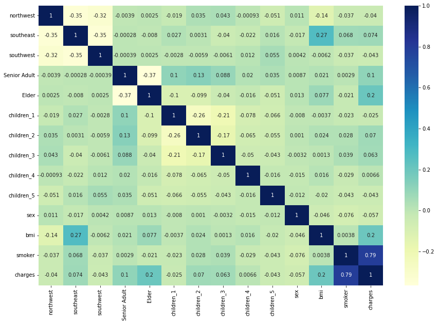

# Medical-Insurance-Forecast---Linear-Regression
Introduction

This project conducts a thorough analysis of personal medical expenses, aiming to uncover the correlations between various lifestyle factors and medical costs. With a focus on the impact of smoking, aging, and Body Mass Index (BMI) on healthcare expenses, this study leverages statistical models to predict individual medical expenditures.
Problem Statement

Health insurance companies operate on the principle of managing financial risk. Accurately predicting medical expenses is crucial for these companies to set premiums that ensure profitability. This project seeks to develop a model that forecasts medical expenses based on patient data, contributing to more informed actuarial decisions in setting insurance premium prices.
Data Exploration and Preprocessing

The analysis begins with:

    Importing the dataset using the pandas library.
    Gaining an initial understanding of the data structure.

Categorical Variable Visualization

The dataset contains several categorical variables. Through visualizations like boxplots, we can observe the distribution and impact of these categorical factors on medical expenses.
Variance Inflation Factor (VIF) Analysis

VIF is used to quantify the extent of correlation between independent variables. It is a crucial step to ensure the reliability of our linear regression model.
Residual Analysis

A residual analysis on the training data is performed to verify the assumption that the error terms are normally distributed—a key consideration for the validity of a linear regression model.
Model Predictions

The model involves:

    Scaling the test data appropriately.
    Calculating R-squared and Adjusted R-squared values to measure the model's predictive power.

Results and Interpretation

The regression model yielded the following insights:

    R-squared and Adjusted R-squared values suggest a strong relationship between the model and the dependent variable.
    The residuals are normally distributed, affirming the model's accuracy.
    Significant predictors include age, BMI, smoking status, and the number of children.
    Smoking has the highest coefficient, indicating its strong influence on medical charges.

Conclusions

The study concludes that while region and gender have a minimal impact on medical expenses, factors such as age, BMI, the number of children, and especially smoking status are significant drivers of medical costs.
